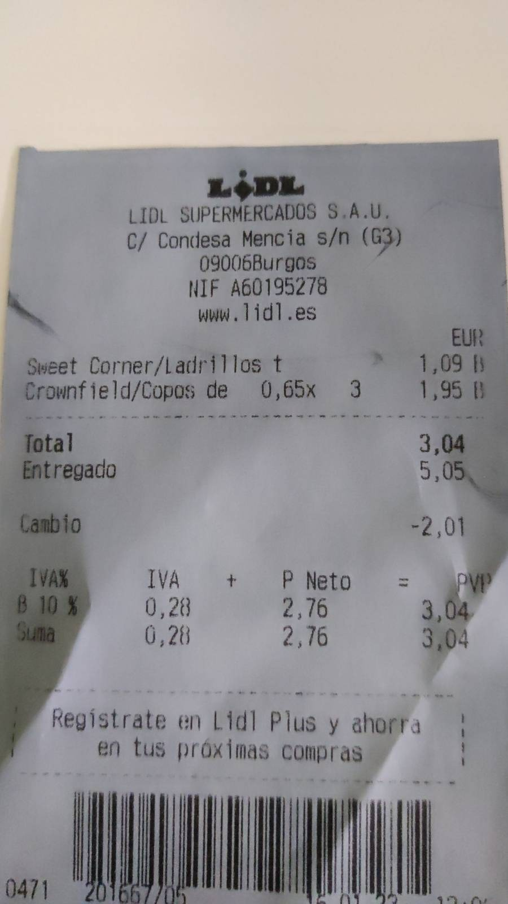

# Receipt reader using CRAFT and TrOCR

## What is CRAFT

CRAFT (Character Region Awareness for Text Detection) is a text detection model based on neural networks, 
This repository doesn't implement CRAFT, it uses this implementation: https://github.com/fcakyon/craft-text-detector 

## What is TrOCR

TrOCR (Transformer-based Optical Character Recognition with Pre-trained Models) is a text recognition model.
The project uses the implementation of huggingface: https://github.com/huggingface/transformers) 

## Why?

While I was trying to read and to proces my receipts for my personal finances (late 2022) many obvious software 
like tesseract or cuneiform didn't have good results. I looked for a modern alternative and the result was this project.

### Limitations

1. The text of the image needs to has a good alignment otherwise the text won't be processed right, this is a TrOCR limitation. The given example isn't in a perfect alignment but is enough to be processed correctly :

  

2. This process is heavier than tesseract or cuneiform. With a Intel i7-1250U the given example takes 
3 minutes and 12 seconds. This is the result:
```
X4.00
LIDL SUPERMERCADOS S.A.U.
C/ CONDESA MENCIA S/N (G3)
09006BURGOS
NIF A60195278
WWW.LIDL.ES
EUR
SWEET CORNER/LADRILLOS T 1.09 B
CROWNFIELD/COPOS DE 0,65X 3 1.95 B
TOTAL 3.04
ENTREGADO 5.05
CAMBIO -2,01
IVAX IVA P NETO = PVP
B 10 % 0.28 2.76 3.04
SUMA 0.28 2.76 3.04
REGISTRATE PROXIMAS COMPRAY SHORRA
0471
```

## Quick start

Verify python version >= 3.10
```commandline
python --version
```

To install dependencies:
```commandline
pip install -r /path/to/requirements.txt
```
or
```commandline
pip install . 
```

### Execute like a command:

```commandline
python command.py --image /path/to/receipt.jpg
```

### Execute like a HTTP service:

#### Start the flask server:
```commandline
flask --app service run
```
Example of invoke using `curl`:
```commandline
curl http://127.0.0.1:5000/ocr -F file=@/path/to/receipt.jpg
```

## Dev

Run tests:
```commandline
pytest test
```